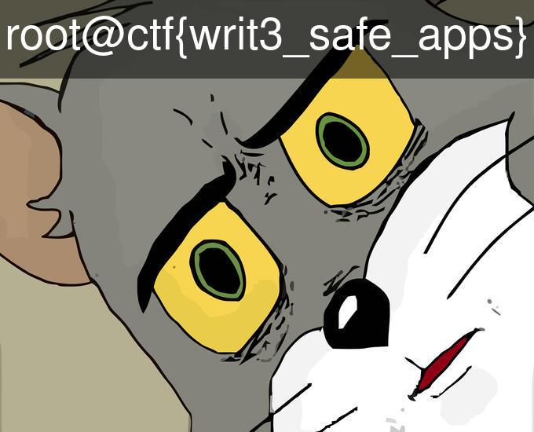

# Meme Maker

## Challenge

Presenting meme maker, write your caption and it makes memes from you. 

The app developer accidentally commit a secret file along with the code. Can you read it?

<detail>
	<summary>Its RCE!</summary>
		```python
		@route("/writetext")
		def writetext():
			yourtext = "\";cat text"
			command = """width=; \
			convert -background '#0008' \
		   -fill white -gravity center \
		   -size `identify -format %w {FILENAME}`x100 caption:"{CAPTION}" {FILENAME} \
		   +swap -gravity north -composite \
		   anno_caption.jpg""".format(FILENAME=IMG_FILE,
							CAPTION=request.query["caption"])

			try:
				output = subprocess.check_output(command, shell=True)
			except subprocess.CalledProcessError:
				pass
			return "<h3>Here is your meme</h3></img>"
		```
</detail>  

## Solution 

The solution? **Remote Code Execution**

The meme maker uses [imagemagick](), a command line image manipulation program. The Python code executes imagemagick's command `convert` to add caption to the text using the subprocess library.

In the webserver, upon sending GET /writetext with caption set to caption you need to embed, the [function](server.py#L8) is called.

The point of weakness is in the `command` variable in [server.py](server.py#L10)

```python
command = """width=; \
    convert -background '#0008' \
   -fill white -gravity center \
   -size `identify -format %w {FILENAME}`x100 caption:"{CAPTION}" {FILENAME} \
   +swap -gravity north -composite \
   anno_caption.jpg""".format(FILENAME=IMG_FILE,
                    CAPTION=request.query["caption"])
```

Notice `caption:"{CAPTION}"`, simple raw substitution of string into a shell command. It is executed as a shell command by subprocess's `check_output` function with `shell=True`.

So with some *shell-fu*, one can use command substitution to run shell code inside a double quote shell string. Try `ls -al` enclosed in backtick(command substitution), you will get this as output:


Ah there is our `flag.txt` in the same directory as the server. Now send `cat flag.txt` enclosed in backtick as caption this time, Voila! Tom is seriously unsettled this time.



### Fix?

If you run a linux machine, try these commands and compare the output

```sh
echo "`uname -a`"
```
vs
```sh
echo '`uname -a`'
```

Does second command still fix the whole RCE vulnerability? 
