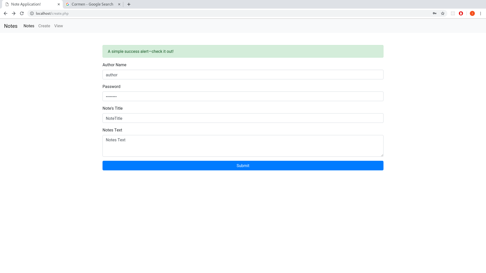
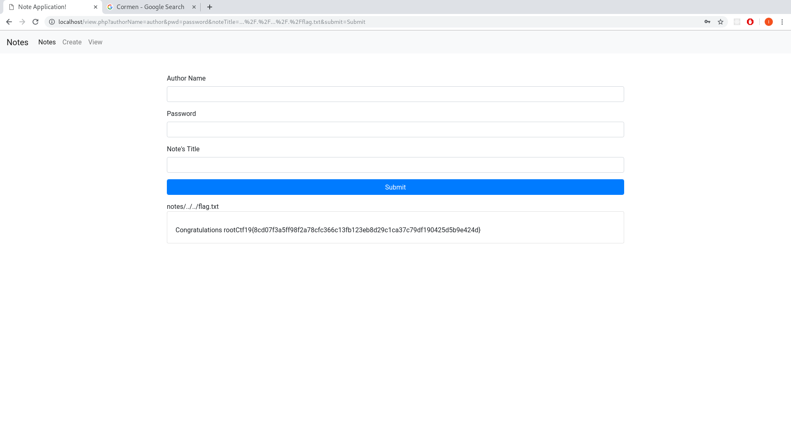

# Inspect

## Challenges


## Solution


The application stores password and notes in different folder.




As mentioned in the problem statement, the application is vulnerable to path traversal attack.

The important points to note here is the input is filtered, that is ** ../ is replaced to '' **

```php

$file_name = str_replace('../','',$file_name) ;
echo $file_name ;

```

Therefore to print the contents of the flag.txt which just lies outside the web server's root directory **..././..././flag.txt** 

